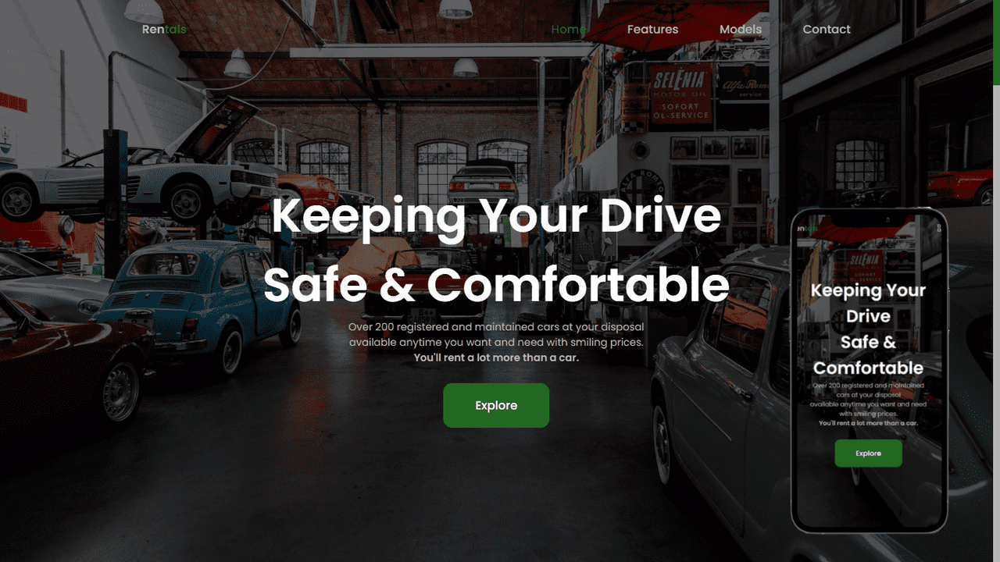

# A Fully Responsive CarRental Website
> This is a basic static website about car rental showcasing my Frond-End skills.
> Live demo [_here_](https://car-rental-8568c3.netlify.app/).

## Table of Contents
* [Overwiew](#overview)
* [Preview](#preview)
* [Tools Used](#tools-used)
* [Built With](#built-with)

### Overview
- A Responsive CarRental Website
- Developed using Mobile First Approach.
- It is compatible with all devices.
- Contains animations when scrolling.

### Preview

### Tools Used
- Logos: https://brandlogos.net/
- Icons: https://boxicons.com/
- Images: https://www.hdcarwallpapers.com/

### Built With
- HTML5
- CSS3
- Javascript
- CSS Flexbox
- CSS Grid
